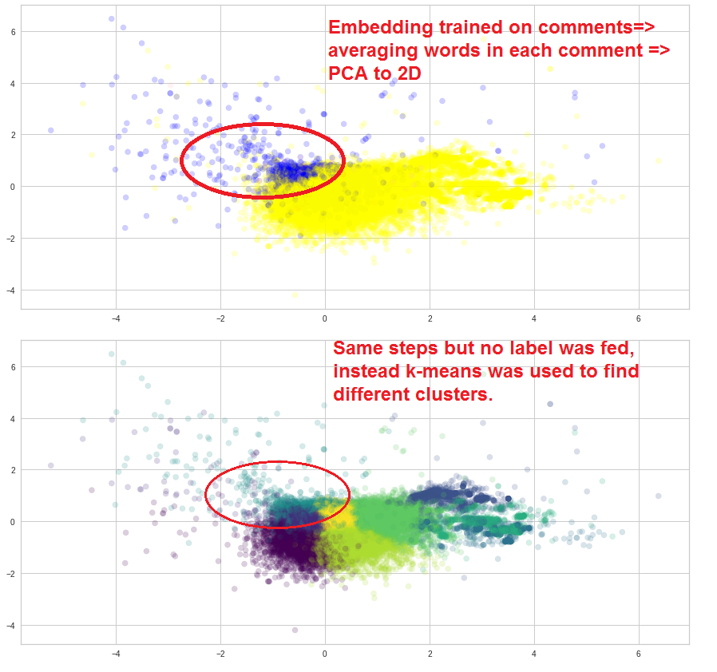

# Wikipedia_Toxic_Comments_Unsupervised_Approach

## Summery
This is an unsupervised approach to a supervised problem. It compares dimensionality reduction using TSNE and PCA, and visulize the results. Also it compares performance of word embedding matrix pretrained imported from GloVe and the embedding matrix trained on the comments. Finally it compares performance of K-means and DBScan.

## State of Problem
The dataset is labeled, and many works showed the success of supervised approach in training a model based on labels. Nonetheless, are the labels actually represent the content of comments? This question comes from the difficulty in assigning the feeling and emotions as labels to text.

## Approach
- Word embedding representation of words averaged over each comment was used to represent each comment in a 100 dimensional space. Embedding matrix was imported from GloVe, and was compared to the one built by feeding comments to word2vec.

- Cleaning: effect of removing stopwords and non-frequent words on training W2V and on clustering was evaluated

- TSNE and PCA where used for dimensionality reduction that used for visualization.

- K-means and DBScan were used for unsupervised clustering.

## Results
1- Embedding matrix trained on comments represent comments better than the one imported from GloVe.
2- It is better not to remove stopwords and non-frequent words during training W2V but to remove them during averaging word vectors for each comment.
3- K-means could pick up the same area of toxic comments similar to the labelled ones, meaning labelling was done in a meaningful way that represented the words used in each comments. 

